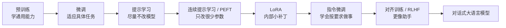
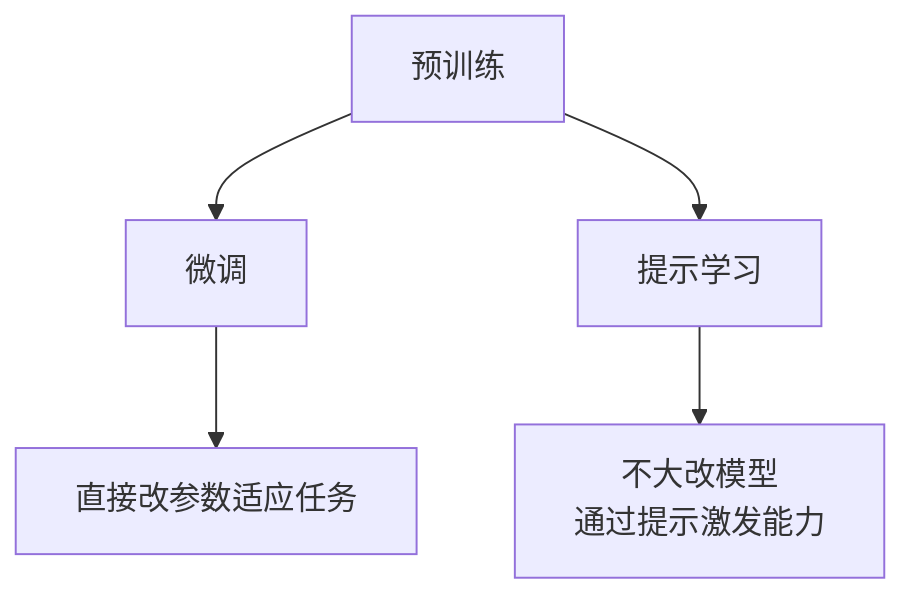
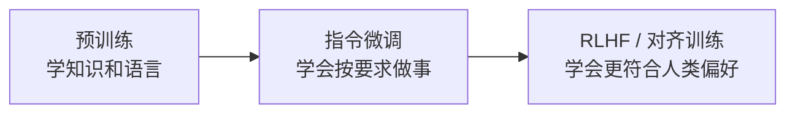
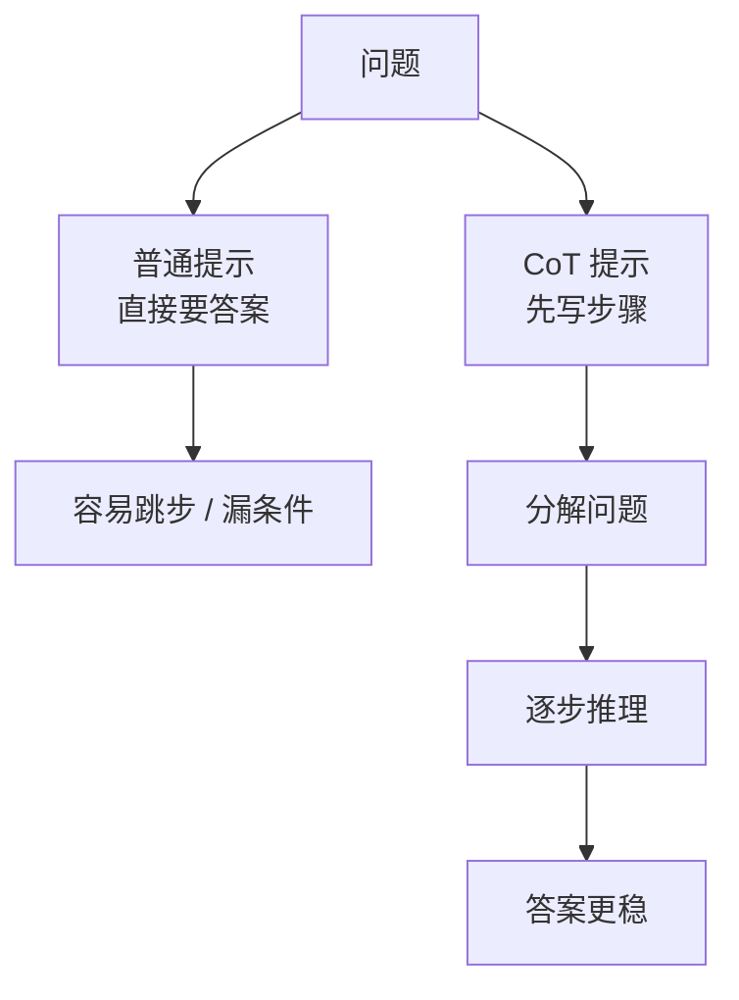
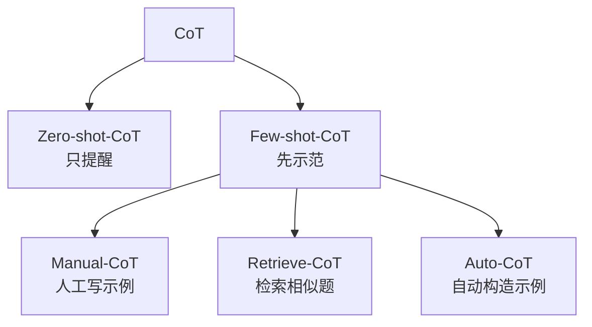
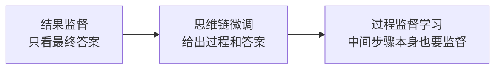
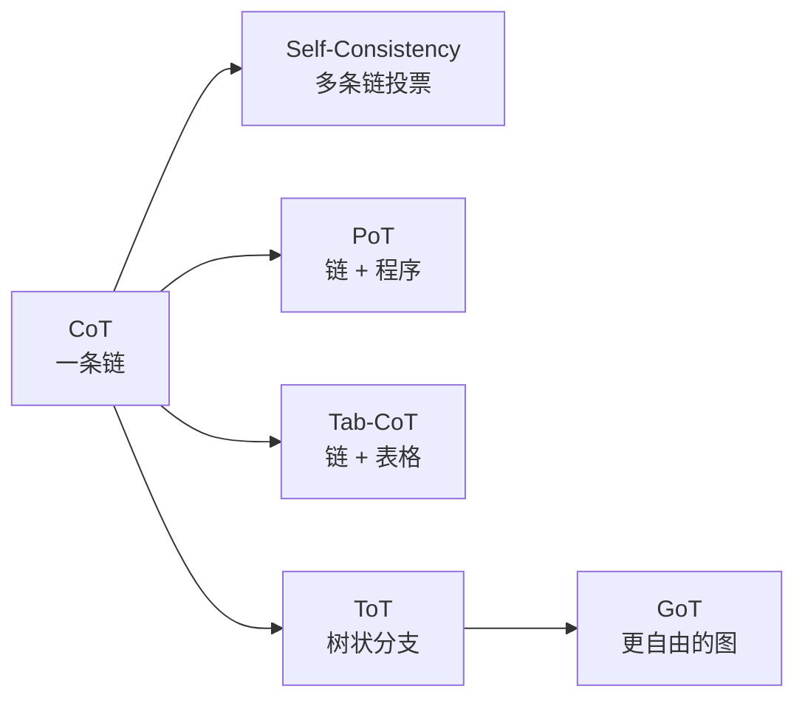
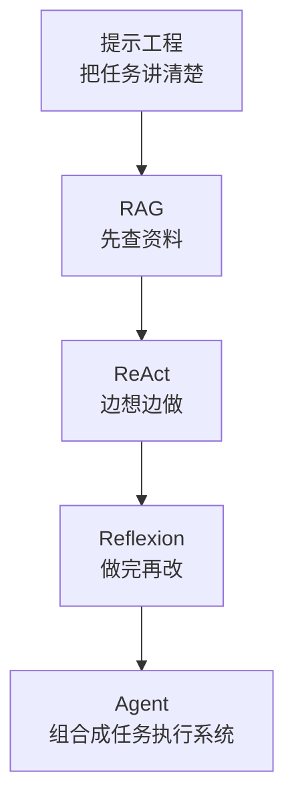
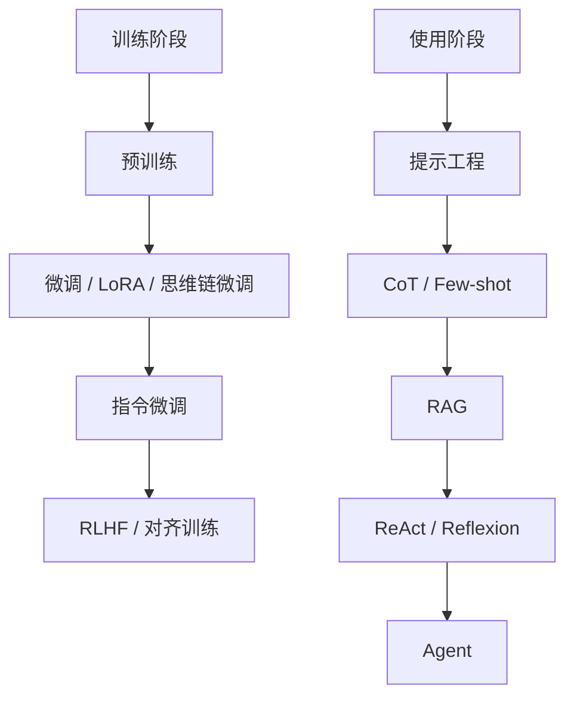

# 思维链与提示工程自学笔记

这份笔记是把前面涉及的大语言模型、提示工程、思维链、RAG、Agent 等内容整理成一份适合自学复习的总笔记。  
目标不是追求术语最全，而是让你能真正看懂这些概念之间的关系。

---

## 目录

- [1. 整体主线](#1-整体主线)
- [2. 预训练、微调、提示学习](#2-预训练微调提示学习)
- [3. 参数高效微调与 LoRA](#3-参数高效微调与-lora)
- [4. 指令微调、对齐训练、RLHF](#4-指令微调对齐训练rlhf)
- [5. 提示工程是什么](#5-提示工程是什么)
- [6. 常见提示方式：Zero-shot、Few-shot、CoT](#6-常见提示方式zero-shotfew-shotcot)
- [7. Few-shot 设计注意点](#7-few-shot-设计注意点)
- [8. 思维链 CoT：为什么有效](#8-思维链-cot为什么有效)
- [9. CoT 家族：Zero-shot-CoT 到 Auto-CoT](#9-cot-家族zero-shot-cot-到-auto-cot)
- [10. 思维链微调](#10-思维链微调)
- [11. 结果监督、思维链微调、过程监督学习](#11-结果监督思维链微调过程监督学习)
- [12. 从 CoT 到 XoT：结构变体](#12-从-cot-到-xot结构变体)
- [13. ReAct、Reflexion、RAG、Agent](#13-reactreflexionragagent)
- [14. 思维链研究版图怎么读](#14-思维链研究版图怎么读)
- [15. 思维链的前沿应用](#15-思维链的前沿应用)
- [16. 采样参数：温度、Top P 等](#16-采样参数温度top-p-等)
- [17. 高频易混概念总对比](#17-高频易混概念总对比)
- [18. 最后怎么整体理解这一块](#18-最后怎么整体理解这一块)

---

## 1. 整体主线

先用一条主线把全局串起来：

```text
预训练
-> 微调
-> 提示学习
-> 连续提示学习 / 参数高效微调
-> LoRA
-> 指令微调
-> 对齐训练 / RLHF
-> 对话式大语言模型
```

这一整条路线一直在解决同一个问题：

`怎样让模型既有通用能力，又能低成本适应任务，并且越来越像一个可用的助手。`

### 一张总图



### 本章只记 3 句

- 大模型的发展主线，本质上是在不断解决“如何低成本适应任务、并更像助手”。
- 前半段更偏“模型能力怎么来”，后半段更偏“模型怎么更会配合人”。
- 预训练、微调、提示工程、RAG、Agent 这些概念不是割裂的，而是一条连续演化路线。

---

## 2. 预训练、微调、提示学习

### 2.1 预训练

预训练就是让模型大量读数据，学会：

- 语言规律
- 常识和知识模式
- 句子怎么组织
- 根据前文预测后文

你可以把它理解成：

`先把模型培养成一个见多识广的通才。`

### 2.2 微调

微调是在预训练模型基础上，再用某个具体任务的数据继续训练。

比如：

- 情感分类
- 摘要
- 翻译
- 问答

你可以把它理解成：

`给通才做专项培训。`

最直白的记法：

- 微调：`改模型`

### 2.3 提示学习

提示学习的想法是：

`模型不一定不会，可能只是你没用它熟悉的方式问。`

比如把分类任务改造成填空题，让模型用它原本擅长的方式做。

最直白的记法：

- 提示学习：`改问法`

### 三者关系图



### 本章只记 3 句

- 预训练是先学通用能力，微调是针对具体任务继续训练。
- 微调的核心是改模型，提示学习的核心是改问法。
- 提示学习并不是训练模型，而是在更聪明地调动模型已有能力。

---

## 3. 参数高效微调与 LoRA

### 3.1 为什么会出现参数高效微调

因为全量微调太贵了：

- 大模型参数太多
- 每个任务都训一份成本高
- 存储和维护都很重

所以大家开始想：

`能不能只改很少的一部分参数，也让模型适应任务？`

### 3.2 连续提示学习

连续提示学习不是让人写一句自然语言提示，而是：

- 在输入前加一小段可训练向量
- 模型主体尽量不动
- 只训练这一小段提示参数

可以理解成：

`给模型一段它自己能懂的“内部暗号”。`

### 3.3 LoRA

LoRA 的做法是：

- 冻结大模型主体
- 在内部某些层旁边加很小的可训练补丁
- 只训练这些补丁

可以理解成：

`不重训整个模型，只在关键内部位置加一个小修正器。`

### 连续提示学习 vs LoRA

| 方法 | 改哪里 | 怎么理解 |
|---|---|---|
| 连续提示学习 | 输入前面的提示向量 | 在前面加暗号 |
| LoRA | 模型内部某些层 | 在里面加补丁 |

### 什么时候考虑用 LoRA / 参数高效微调

| 场景 | 更适合什么 |
|---|---|
| 只是临时问几个问题 | 先用提示工程 |
| 想让模型长期适配某个任务，但预算有限 | LoRA / 参数高效微调 |
| 任务很多、知识经常变化 | RAG 往往比微调更合适 |
| 必须把某种风格或行为稳定训练进去 | 微调或 LoRA |

### 本章只记 3 句

- 参数高效微调的目标是：少改参数，也能适应任务。
- 连续提示学习更像在输入前加可训练暗号，LoRA 更像在模型内部加补丁。
- LoRA 是今天非常常见的一种低成本模型适配方法。

---

## 4. 指令微调、对齐训练、RLHF

### 4.1 为什么预训练后还不够

预训练后的模型很会续写，但不一定会“按要求办事”。

也就是说：

`它会说话，不代表它会当助手。`

### 4.2 指令微调

指令微调是让模型学会：

`看到指令后，按要求完成任务。`

例如：

- 请总结下面内容
- 请翻译成英文
- 请按表格输出

最直白的理解：

`让模型从“会说话”变成“会按要求做事”。`

### 4.3 对齐训练

对齐训练关注的是：

`怎样让模型更像人愿意使用的助手。`

目标通常包括：

- 更有帮助
- 更自然
- 更安全
- 更少胡说

### 4.4 RLHF

RLHF = `基于人类反馈的强化学习`

最白的话解释：

`让人告诉模型哪些回答更好，再把模型往“更像好助手”的方向调整。`

### 对比图



### 本章只记 3 句

- 指令微调解决的是“会不会按要求做事”。
- 对齐训练和 RLHF 解决的是“做得像不像一个人愿意用的助手”。
- 预训练、指令微调、RLHF 叠在一起，才更接近今天的对话式大模型。

---

## 5. 提示工程是什么

提示工程就是：

`为了让大模型更好完成任务，系统地设计和优化提示词。`

最白的话：

`研究怎么提问，才能让模型更好地干活。`

它通常在做这些事：

- 把任务说明清楚
- 补充上下文
- 指定输出格式
- 给示例
- 按步骤引导

提示工程不是训练模型，而是：

`更聪明地使用模型。`

### 写提示时最实用的 5 个检查问题

1. 我要模型做什么？
2. 它需要哪些背景信息？
3. 输出应该长什么样？
4. 要不要给例子？
5. 这个任务需不需要拆步骤？

### 本章只记 3 句

- 提示工程不是神秘口诀，而是把任务讲清楚。
- 好提示的关键通常是：任务明确、背景足够、格式清楚。
- 模型越强，花哨技巧越没那么重要，但清晰表达永远重要。

---

## 6. 常见提示方式：Zero-shot、Few-shot、CoT

### 6.1 Zero-shot

不给示例，直接让模型做。

可以理解成：

`不演示，直接出题。`

### 6.2 One-shot / Few-shot

先给 1 个或几个例子，再让模型照着做。

可以理解成：

`先做一道例题，再让模型做新题。`

### 6.3 In-context learning

模型不重新训练，只靠当前输入中的上下文和示例，就在当前会话里“学会”怎么做任务。

可以理解成：

`现学现用。`

### 6.4 Chain-of-Thought（CoT）

让模型不要直接报答案，而是先写出推理过程。

最白的话：

`让模型一步一步想。`

### 提示方式对比表

| 方法 | 有没有示例 | 核心作用 | 最白的话 |
|---|---|---|---|
| Zero-shot | 没有 | 直接做任务 | 不演示，直接做 |
| Few-shot | 有 | 给任务模板 | 先看例题再做 |
| CoT | 可有可无 | 显式写推理过程 | 一步一步想 |

### 什么时候用哪种提示方式

| 场景 | 更适合什么 |
|---|---|
| 任务简单、模型本身很强 | Zero-shot |
| 任务标准不明显、输出格式容易乱 | Few-shot |
| 问题需要多步推理 | CoT |
| 任务又复杂又不稳定 | Few-shot + CoT |

### 本章只记 3 句

- Zero-shot 是不举例，Few-shot 是先举例，CoT 是把推理过程展开。
- Few-shot 主要是在给任务模板，CoT 主要是在给推理模板。
- 如果任务需要多步推理，CoT 往往比直接问更有效。

---

## 7. Few-shot 设计注意点

Few-shot 不是随便塞几个例子就行，常见要点有：

- 示例数量
- 使用格式
- 输入文本分布和标签空间
- 示例相关性

一个很重要的经验是：

`模型有时学到的不只是“答案是什么”，还学到“这到底是什么任务、输入输出怎么配对”。`

所以 few-shot 中：

- 格式很重要
- 输入输出配对很重要
- 示例和当前任务的相关性也很重要

### 本章只记 3 句

- Few-shot 的作用不只是给答案，更是在告诉模型“这是什么任务”。
- 示例格式和输入输出配对方式，往往比想象中更重要。
- 设计 few-shot 时，相关性、覆盖面和整齐的格式都很关键。

---

## 8. 思维链 CoT：为什么有效

### 8.1 现象层面

CoT 在很多复杂任务上能明显提升效果，尤其是：

- 数学推理
- 常识推理
- 逻辑推理

### 8.2 工程角度

CoT 通常更适合：

- 大模型
- 难任务
- 需要多步推理的任务

### 8.3 理论角度

一个常见理解是：

`大模型内部本来就有很多相关知识碎片，CoT 帮助它把这些知识按逻辑顺序串起来。`

### CoT 为什么有效：示意图



### 本章只记 3 句

- CoT 的本质不是让模型变啰嗦，而是让推理过程显式化。
- CoT 特别适合大模型和复杂多步任务。
- 一个常见理解是：CoT 帮助模型把内部已有知识按逻辑顺序组织起来。

---

## 9. CoT 家族：Zero-shot-CoT 到 Auto-CoT

### 9.1 Zero-shot-CoT

不举例，只加一句：

`Let's think step by step.`

也就是：

`不示范，只提醒模型按步骤想。`

### 9.2 Few-shot-CoT / Manual-CoT

先给模型看几个：

- 问题
- 推理过程
- 答案

再让它模仿。

也就是：

`先给解题模板，再让它照着解。`

### 9.3 Retrieve-CoT

从题库里找和当前问题最像的题目，拿来做示范。

### 9.4 Auto-CoT

自动把问题分成几类，从每类挑代表题，再自动生成思维链示例。

### CoT 家族结构图



### 本章只记 3 句

- Zero-shot-CoT 是只提醒模型按步骤想，Few-shot-CoT 是先给带推理过程的示范。
- Manual、Retrieve、Auto 这些方法，本质上都在解决“高质量 CoT 示例从哪来”。
- CoT 家族是在不断降低人工成本，同时让推理示例更有效。

---

## 10. 思维链微调

前面的 CoT 多数还是推理时的提示技巧。  
思维链微调更进一步，它是：

`用“问题 + 推理过程 + 答案”这类数据去训练模型。`

换句话说：

- 提示式 CoT：推理时提醒模型按步骤想
- 微调式 CoT：训练时把“按步骤推理”能力教进去

思维链微调的关键包括：

- 高质量数据准备
- 多样化推理路径
- 训练策略设计

### 提示式 CoT vs 微调式 CoT

| 路线 | 发生在什么时候 | 核心特点 |
|---|---|---|
| 提示式 CoT | 推理时 | 临时提醒模型按步骤想 |
| 微调式 CoT | 训练时 | 把按步骤推理能力训练进去 |

### 本章只记 3 句

- 提示式 CoT 是临时提醒，思维链微调是长期训练。
- 思维链微调能让模型更稳定地按步骤推理和按要求输出。
- 真正难的地方不只是训练，而是准备高质量、多样化的数据。

---

## 11. 结果监督、思维链微调、过程监督学习

这三个很容易混，但可以按“监督越来越细”来理解。

### 11.1 结果监督

只看最终答案。

像老师只看：

`最后答对没有。`

### 11.2 思维链微调

给模型看过程和答案，让它学会把过程说出来。

像老师说：

`把步骤写出来。`

### 11.3 过程监督学习

不仅要过程，还要监督中间步骤是否合理。

像老师逐步检查：

- 这一步对不对
- 有没有跳步
- 中间推理是否靠谱

### 三者对比图



### 三者对比表

| 方法 | 监督什么 | 最白的话 |
|---|---|---|
| 结果监督 | 最终答案 | 只看终点 |
| 思维链微调 | 过程 + 答案 | 教它把步骤说出来 |
| 过程监督学习 | 过程质量 + 答案 | 教它把步骤走对 |

### 本章只记 3 句

- 结果监督只看最终答案，过程监督会看中间步骤是不是合理。
- 思维链微调已经开始关注过程，但过程监督更进一步，强调逐步质量。
- 对复杂推理任务来说，只看最终答案通常不够。

---

## 12. 从 CoT 到 XoT：结构变体

CoT 是线性的“一条链”，后来大家开始研究更多推理结构。

### 12.1 CoT

一步一步想。

### 12.2 Self-Consistency

生成多条 CoT，再投票选多数答案。

可以理解成：

`多试几次，再看大多数结果。`

### 12.3 Program of Thought（PoT）

把推理中可计算的部分写成程序，再交给 Python、SymPy 等执行。

可以理解成：

`想法由模型给，计算交给程序。`

### 12.4 Tab-CoT

把推理过程写成表格，比如：

- step
- subquestion
- procedure
- result

可以理解成：

`把解题过程整理成步骤表。`

### 12.5 Tree-of-Thought（ToT）

不是只沿一条路走，而是展开多个思路分支，再评估和选择。

可以理解成：

`像走迷宫一样，边试边选。`

### 12.6 Graph-of-Thought（GoT）

把思维过程建模成图，不同思路可以：

- 交叉
- 汇合
- 回溯
- 重组

可以理解成：

`把推理过程变成一张可回连的网络。`

### 结构变体总图



### 结构变体对比表

| 方法 | 结构形态 | 解决什么问题 | 最白的话 |
|---|---|---|---|
| CoT | 一条链 | 模型容易跳步 | 一步一步想 |
| Self-Consistency | 多条链并行 | 单条推理可能走偏 | 多想几次再投票 |
| PoT | 链 + 程序 | 计算容易算错 | 让程序帮忙算 |
| Tab-CoT | 表格 | 自然语言过程太散 | 把步骤列成表 |
| ToT | 树 | 一条线不够处理复杂搜索 | 多分支探索 |
| GoT | 图 | 树结构仍然不够灵活 | 推理网络化 |

### 结构选择建议

| 任务特点 | 更适合什么 |
|---|---|
| 一般多步推理 | CoT |
| 单条链容易走偏 | Self-Consistency |
| 计算量大、容易算错 | PoT |
| 想让步骤更整齐、更结构化 | Tab-CoT |
| 需要试错、规划、搜索 | ToT |
| 不同思路需要汇合、回溯、重组 | GoT |

### 本章只记 3 句

- 从 CoT 到 XoT，本质上是在不断改变“推理结构”。
- 不同结构不是谁替代谁，而是各自适合不同类型的问题。
- 线性链、表格、程序、树、图，都是组织思维过程的不同方式。

---

## 13. ReAct、Reflexion、RAG、Agent

### 13.1 ReAct

ReAct = `Reason + Act`

核心就是：

`边推理，边行动。`

例如：

- 先想下一步该做什么
- 再搜索 / 调工具 / 执行动作
- 看结果
- 再继续想

### 13.2 Reflexion

Reflexion 的核心是：

`做完以后回头检查和修正。`

不是继续乱试，而是先总结：

- 刚才哪里错了
- 为什么错
- 下一轮怎么改

### 13.3 RAG

RAG = `检索增强生成`

核心就是：

`先查资料，再根据资料回答。`

### 13.4 Agent

当这些能力组合起来时，模型就更像一个智能体：

- 会理解任务
- 会查资料
- 会调工具
- 会根据反馈修正

### 四者关系图



### 四者最白记忆版

- RAG：`先查再答`
- ReAct：`边想边做`
- Reflexion：`做完再改`
- Agent：`把这些能力组合起来做任务`

### 什么时候优先考虑哪种方法

| 问题 | 更适合什么 |
|---|---|
| 模型缺资料或知识不是最新的 | RAG |
| 任务需要查工具、调接口、执行动作 | ReAct |
| 模型第一版结果容易错，需要迭代修正 | Reflexion |
| 任务是复杂工作流，不是单次问答 | Agent |

### 本章只记 3 句

- RAG 解决“知识不够”，ReAct 解决“只会想不会做”，Reflexion 解决“做错后不会改”。
- Agent 不是一个单点技巧，而是把这些能力组织成系统。
- 真正复杂的 AI 系统，往往是提示、RAG、工具、反思一起用。

---

## 14. 思维链研究版图怎么读

思维链研究大致沿着三条线发展：

### 14.1 Prompting pattern

研究：

`怎么把思维链引出来。`

典型内容：

- Zero-shot
- Plan-and-Solve
- Manual-CoT
- Auto-CoT

### 14.2 Reasoning format

研究：

`推理过程本身应该怎么组织。`

典型内容：

- CoT
- ToT
- GoT
- PoT
- Self-consistency
- Self-verification

### 14.3 Application scenario

研究：

`思维链最终用在哪些任务和系统里。`

典型内容：

- NLP 任务
- Agent
- 多模态
- 多语言
- 科学任务
- 安全性

### 版图阅读法

以后看到一个新方法，可以先问自己三件事：

1. 它是在研究`怎么提示`？
2. 它是在研究`怎么推理`？
3. 它是在研究`怎么应用`？

### 本章只记 3 句

- 思维链研究已经不只是一个提示技巧，而是一个完整研究方向。
- 看一张研究版图时，先分清它是在研究“怎么提示、怎么推理、还是怎么应用”。
- 不需要记住所有方法名，先抓住三条主线更重要。

---

## 15. 思维链的前沿应用

### 15.1 多模态

思维链不再只处理文字，还可以结合：

- 图片
- 图表
- 图结构

也就是：

`一边看图，一边看文字，再一步步推理。`

### 15.2 多语言

思维链可以跨语言迁移。

常见现象是：

`英文推理链有时能帮助其他语言任务。`

### 15.3 智能体

思维链是 Agent 决策的内部骨架，它帮助 Agent：

- 拆任务
- 选动作
- 用工具
- 看反馈
- 做修正

### 15.4 跨领域

思维链正在进入更专业的场景，比如：

- 化学
- 医学
- 科学计算

这类任务通常会把：

- 结构化指令
- 逐步推理
- 反思和验证

结合起来。

### 本章只记 3 句

- 思维链已经从纯文本推理扩展到多模态、多语言、智能体和专业领域。
- 在 Agent 场景里，思维链更像任务执行的内部决策骨架。
- 在专业领域里，思维链通常会和结构化约束、工具和验证一起使用。

---

## 16. 采样参数：温度、Top P 等

### 16.1 温度（Temperature）

控制发散程度。

- 高：更随机、更有创意
- 低：更稳定、更保守

### 16.2 Top P

控制候选词采样范围。

- 高：选择范围更大
- 低：更收敛

### 16.3 Presence Penalty

鼓励引入新内容。

### 16.4 Frequency Penalty

减少重复。

### 16.5 Max Tokens

控制最长输出。

### 三种常见风格

| 风格 | 大致特点 | 适合场景 |
|---|---|---|
| 创新型 | 随机性高，表达更发散 | 文案、头脑风暴、创意写作 |
| 平衡型 | 稳定和灵活折中 | 通用问答、普通写作 |
| 准确型 | 更保守、更收敛 | 总结、技术说明、结构化输出 |

### 本章只记 3 句

- 温度和 Top P 主要控制随机性，不直接增加知识。
- 想更有创意就提高随机性，想更稳就降低随机性。
- 这些参数更像“风格旋钮”，不是“准确率开关”。

---

## 17. 高频易混概念总对比

### 17.1 微调 vs 提示学习

| 概念 | 核心区别 |
|---|---|
| 微调 | 改模型 |
| 提示学习 | 改问法 |

### 17.2 提示工程 vs 提示学习

| 概念 | 核心区别 |
|---|---|
| 提示工程 | 更偏使用方法，怎么把提示写好 |
| 提示学习 | 更偏研究概念，用 prompt 让模型适应任务 |

### 17.3 连续提示学习 vs LoRA

| 概念 | 核心区别 |
|---|---|
| 连续提示学习 | 在输入前加可训练提示向量 |
| LoRA | 在模型内部加小补丁 |

### 17.4 指令微调 vs RLHF

| 概念 | 核心区别 |
|---|---|
| 指令微调 | 教模型会做事 |
| RLHF | 教模型把事做得更符合人类偏好 |

### 17.5 RAG vs 微调

| 概念 | 核心区别 |
|---|---|
| 微调 | 把知识写进参数 |
| RAG | 回答前先查资料 |

### 17.6 CoT vs ToT vs ReAct vs Reflexion

| 概念 | 核心区别 |
|---|---|
| CoT | 一步一步想 |
| ToT | 多分支探索 |
| ReAct | 边想边做 |
| Reflexion | 做完再改 |

### 17.7 结果监督 vs 过程监督

| 概念 | 核心区别 |
|---|---|
| 结果监督 | 只看最终答案 |
| 过程监督 | 中间步骤也要管 |

### 最常用概念总览图



### 本章只记 3 句

- 训练阶段的方法和使用阶段的方法要分开理解。
- 微调、LoRA、思维链微调更偏训练期；提示工程、RAG、Agent 更偏使用期。
- 很多真实系统不是选一种方法，而是多种方法叠加。

---

## 18. 最后怎么整体理解这一块

如果把这一大块内容用最简单的话串起来，大概就是：

1. 大模型先通过预训练学会通用能力  
2. 微调和参数高效微调用来适应具体任务  
3. 提示工程帮助我们更好地把模型能力激发出来  
4. 思维链让模型更适合处理复杂推理问题  
5. 后来大家开始研究更多推理结构，比如树、图、程序、表格  
6. 再往后，思维链和 RAG、工具、Agent、反思机制结合，形成更复杂的任务解决系统  
7. 现在思维链已经从文本推理扩展到多模态、多语言、智能体和专业领域  

### 一套最值得记住的超短版

- 预训练：先让模型有基础能力
- 微调：改模型去适应任务
- 提示工程：把任务讲清楚
- CoT：让模型一步一步想
- ToT：让模型多分支探索
- ReAct：让模型边想边做
- Reflexion：让模型做完再改
- RAG：让模型先查资料再回答
- LoRA：只训练模型内部的小补丁
- RLHF：让模型更像人类愿意使用的助手

### 最后真正重要的几个直觉

- 模型能力不只取决于模型本身，也取决于你怎么用它
- 提示、微调、RAG、工具、Agent 不是互斥关系，而是可以叠加
- 思维链不是“让模型啰嗦”，而是在组织推理过程
- 复杂任务往往需要：检索、推理、行动、反思、验证共同配合

如果你能抓住这几个直觉，这一整块就算真的学进去了。

---

## 19. 复习时最推荐的阅读顺序

如果你以后想快速复习，建议按这个顺序看：

1. 先看第 1 节，回忆总主线
2. 再看第 17 节，快速区分容易混的概念
3. 接着看第 6、8、9、12 节，重点复习提示与思维链
4. 然后看第 13 节，理解 RAG / ReAct / Reflexion / Agent
5. 最后看第 18 节，重新把所有东西串起来

如果只剩 10 分钟，就重点看：

- 第 1 节
- 第 17 节
- 第 18 节
